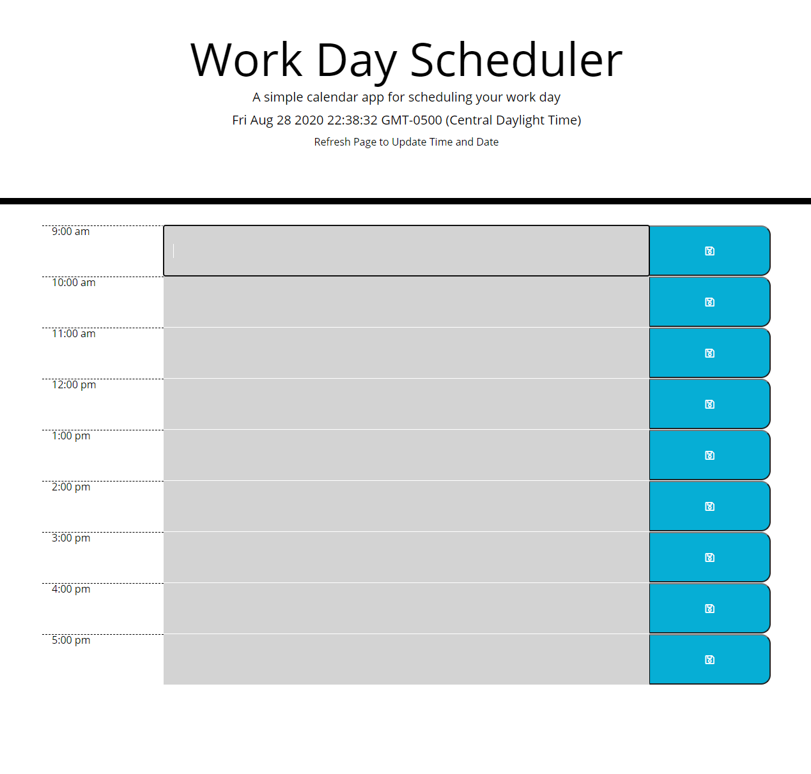
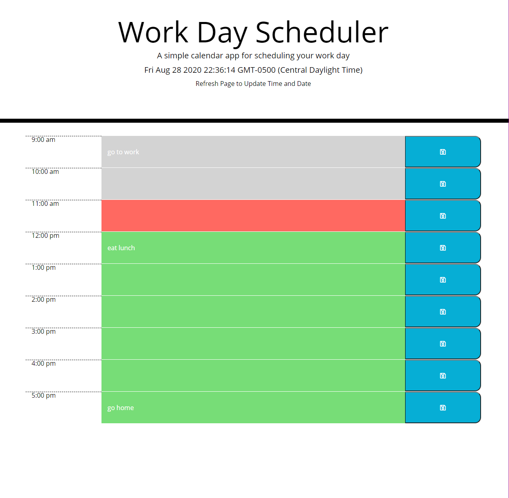

## Work Day Planner

# Description

This is a planner arranged for the standard 9-5 work day. The planner allows you to enter whatever text you would like for each hour and save it by pressing the blue button next to it.  
At the top of the page the planner will load the current date, as well as the time at which you loaded the page.  
Refreshing the page will update both the date and the time. Refreshing the page will not erase whatever text you enter into the input and save. This text will be sent to the local storage where you can access it again within your browser.

## Usage
Click on the input field corresponding to the time you would like to make a note and enter your note. Click the blue save button afterwards to save your note to local storage.

Your planner will display three different colors based on the current time:
* grey shows past events
* red shows current events
* green shows future events

Refreshing your browser will update the time and the corresponding colors for your planner. If you wish to remove a saved note from your planner simply click on the text field, erase your text and hit the save button.
